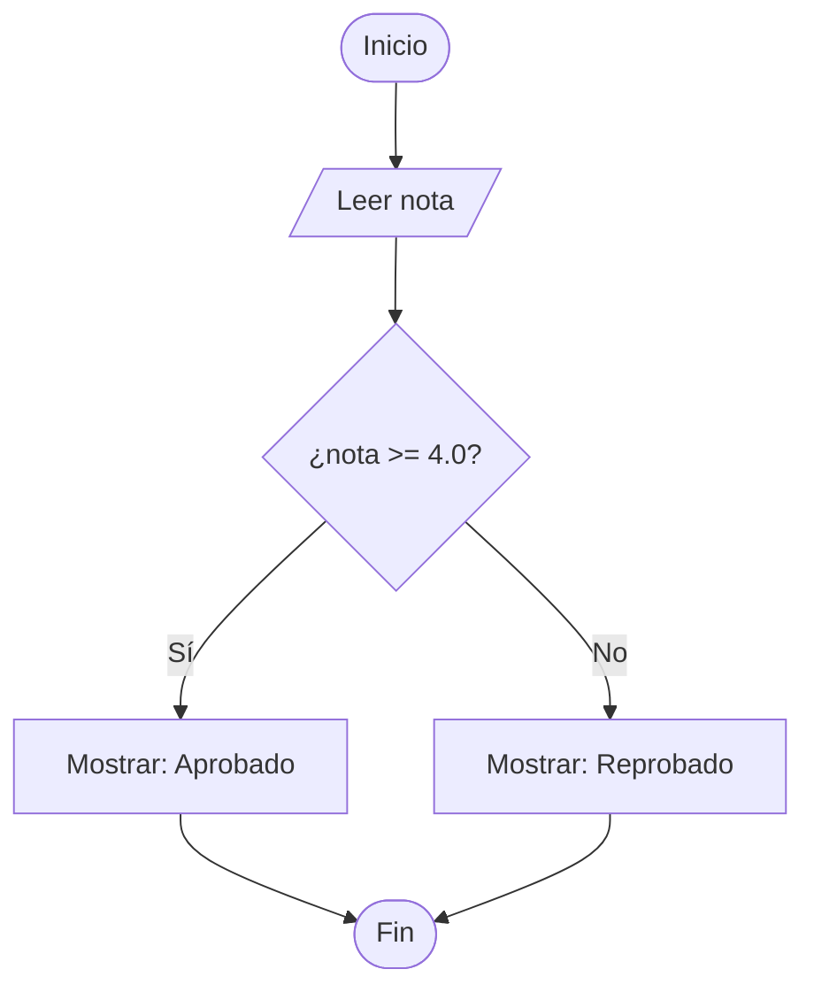

# 💻 Apuntes y Guía Completa: Curso de PSeInt desde Cero (15 Clases)

> **Descripción:** Cuaderno de apuntes estructurado en Markdown que cubre al 100% las 15 clases del curso **PSeInt desde Cero**.

---

## 📌 Tabla de Contenidos (15 Clases)
- [Clase 1: Introducción al curso y consideraciones](#clase-1-introducción-al-curso-y-consideraciones)
- [Clase 2: Descarga e instalación de PSeInt](#clase-2-descarga-e-instalación-de-pseint)
- [Clase 3: Configurar PSeInt y opciones del lenguaje](#clase-3-configurar-pseint-y-opciones-del-lenguaje)
- [Clase 4: Recorrido por PSeInt](#clase-4-recorrido-por-pseint)
- [Clase 5: Estructura del pseudocódigo y Hola mundo](#clase-5-estructura-del-pseudocódigo-y-hola-mundo)
- [Clase 6: Variables y tipos de datos](#clase-6-variables-y-tipos-de-datos)
- [Clase 7: Entrada, salida y concatenación de datos](#clase-7-entrada-salida-y-concatenación-de-datos)
- [Clase 8: Operadores aritméticos y jerarquía de las operaciones](#clase-8-operadores-aritméticos-y-jerarquía-de-las-operaciones)
- [Clase 9: Operadores relacionales](#clase-9-operadores-relacionales)
- [Clase 10: Estructuras de control](#clase-10-estructuras-de-control)
- [Clase 11: Operadores lógicos](#clase-11-operadores-lógicos)
- [Clase 12: Arreglos y listas](#clase-12-arreglos-y-listas)
- [Clase 13: Ciclos](#clase-13-ciclos)
- [Clase 14: Funciones](#clase-14-funciones)
- [Clase 15: Siguientes pasos, conclusiones y despedida](#clase-15-siguientes-pasos-conclusiones-y-despedida)

---

## Clase 1: Introducción al curso y consideraciones *(1:14)*

**Explicación:** Presentación del curso y recomendaciones de estudio para entender la lógica de programación mediante pseudocódigo en español.

> [!NOTE]
> **¿Qué es PSeInt?**  
> Es un software diseñado para principiantes que facilita el aprendizaje de algoritmos sin la complicación sintáctica de un lenguaje de programación real.

---

## Clase 2: Descarga e instalación de PSeInt *(5:04)*

**Explicación:** Guía paso a paso para descargar e instalar PSeInt en el equipo.

1. Visitar la página oficial de SourceForge de PSeInt.
2. Elegir la versión correspondiente al sistema operativo (Windows, macOS o Linux).
3. Ejecutar el asistente de instalación predeterminado.

---

## Clase 3: Configurar PSeInt y opciones del lenguaje *(2:51)*

**Explicación:** Selección del perfil de reglas en PSeInt (*Opciones > Opciones del Lenguaje*).

* **Perfil Flexible:** Permite escribir código laxo (no exige punto y coma ni declarar variables previamente).
* **Perfil Estricto:** Exige sintaxis rigurosa (definir tipos de datos y usar `;`), ideal para adaptarse a lenguajes reales como Java, C++ o JavaScript.

---

## Clase 4: Recorrido por PSeInt *(7:45)*

**Explicación:** Explicación detallada del entorno de desarrollo de PSeInt.

* **Panel Lateral Derecho:** Botones con comandos de inserción rápida (`Escribir`, `Leer`, `Si-Entonces`, `Para`, etc.).
* **Botón Ejecutar (Play Verde):** Corre el algoritmo.
* **Ejecución Paso a Paso:** Muestra en tiempo real la ejecución de cada línea para depurar errores.
* **Dibujar Diagrama de Flujo:** Convierte automáticamente el pseudocódigo en un diagrama gráfico.

---

## Clase 5: Estructura del pseudocódigo y Hola mundo *(5:23)*

**Explicación:** Estructura fundamental de un algoritmo. La instrucción `Escribir` muestra información en la pantalla.

```pseint
Algoritmo HolaMundo
    // Todo código debe ir dentro del bloque Algoritmo / FinAlgoritmo
    Escribir "¡Hola Mundo!";
FinAlgoritmo
```

---

## Clase 6: Variables y tipos de datos *(5:29)*

**Explicación:** Una variable guarda datos en memoria RAM. Se declara con `Definir` y se le asigna valor con `<-`.

| Tipo de Dato | Descripción | Ejemplo | Sintaxis |
| :--- | :--- | :--- | :--- |
| **Entero** | Números sin decimales | `25`, `-5` | `Definir edad Como Entero;` |
| **Real** | Números con decimales | `3.14`, `6.5` | `Definir nota Como Real;` |
| **Cadena** | Texto entre comillas | `"Fernanda"` | `Definir nombre Como Cadena;` |
| **Logico** | Valores booleanos | `Verdadero`, `Falso` | `Definir activo Como Logico;` |

```pseint
Algoritmo Variables
    Definir edad Como Entero;
    edad <- 25;
FinAlgoritmo
```

---

## Clase 7: Entrada, salida y concatenación de datos *(6:59)*

**Explicación:** Captura de datos con `Leer` y unión de textos con variables (concatenación) usando comas `,`.

```pseint
Algoritmo EntradaSalida
    Definir usuario Como Cadena;
    Escribir "Ingresa tu nombre:";
    Leer usuario;
    Escribir "¡Hola ", usuario, ", bienvenido/a!";
FinAlgoritmo
```

---

## Clase 8: Operadores aritméticos y jerarquía de las operaciones *(6:48)*

**Explicación:** Operaciones matemáticas básicas y su orden de evaluación.

* **Operadores:** Suma (`+`), Resta (`-`), Multiplicación (`*`), División (`/`), Potencia (`^`), Módulo (`MOD`).
* **Jerarquía:**
  1. Paréntesis `()`
  2. Potencias `^`
  3. Multiplicación, División y Módulo `*`, `/`, `MOD`
  4. Sumas y Restas `+`, `-`

---

## Clase 9: Operadores relacionales *(5:09)*

**Explicación:** Comparación de valores que retornan un resultado booleano (`Verdadero` o `Falso`).

* Igual: `=`
* Diferente: `<>`
* Mayor que / Menor que: `>`, `<`
* Mayor o igual / Menor o igual: `>=`, `<=`

---

## Clase 10: Estructuras de control *(13:23)*

**Explicación:** Toma de decisiones condicionales en el código con `Si - Entonces - Sino`.

```pseint
Algoritmo Decisiones
    Definir nota Como Real;
    Escribir "Ingresa tu nota:";
    Leer nota;
    
    Si nota >= 4.0 Entonces
        Escribir "Aprobado";
    Sino
        Escribir "Reprobado";
    FinSi
FinAlgoritmo
```

### Diagrama Mermaid del Condicional


---

## Clase 11: Operadores lógicos *(10:16)*

**Explicación:** Combinación de múltiples condiciones.

* **`Y` (`AND`):** Devuelve `Verdadero` solo si TODAS las condiciones son verdaderas.
* **`O` (`OR`):** Devuelve `Verdadero` si AL MENOS UNA condición es verdadera.
* **`NO` (`NOT`):** Invierte el valor lógico (`NO Verdadero` = `Falso`).

---

## Clase 12: Arreglos y listas *(6:31)*

**Explicación:** Estructuras de datos (vectores) para almacenar múltiples elementos bajo un solo nombre usando la instrucción `Dimension`.

```pseint
Algoritmo Arreglos
    Definir notas Como Real;
    Dimension notas[3]; // Guarda 3 datos
    
    notas[1] <- 6.5;
    notas[2] <- 5.0;
    notas[3] <- 7.0;
FinAlgoritmo
```

---

## Clase 13: Ciclos *(15:30)*

**Explicación:** Repetición de bloques de código mediante estructuras iterativas (`Para`, `Mientras`, `Repetir-Hasta Que`).

```pseint
Algoritmo CicloPara
    Para i <- 1 Hasta 5 Con Paso 1 Hacer
        Escribir "Número: ", i;
    FinPara
FinAlgoritmo
```

---

## Clase 14: Funciones *(17:09)*

**Explicación:** Subprogramas o bloques de código independientes y reutilizables que aceptan parámetros y devuelven valores.

```pseint
Funcion resultado <- Sumar(a, b)
    Definir resultado Como Entero;
    resultado <- a + b;
FinFuncion

Algoritmo Principal
    Definir total Como Entero;
    total <- Sumar(10, 15);
    Escribir "Suma: ", total;
FinAlgoritmo
```

---

## Clase 15: Siguientes pasos, conclusiones y despedida *(1:08)*

**Explicación:** Cierre del curso, consejos para continuar ejercitando la lógica de programación y dar el paso hacia un lenguaje real como Python, C++, Java o JavaScript.