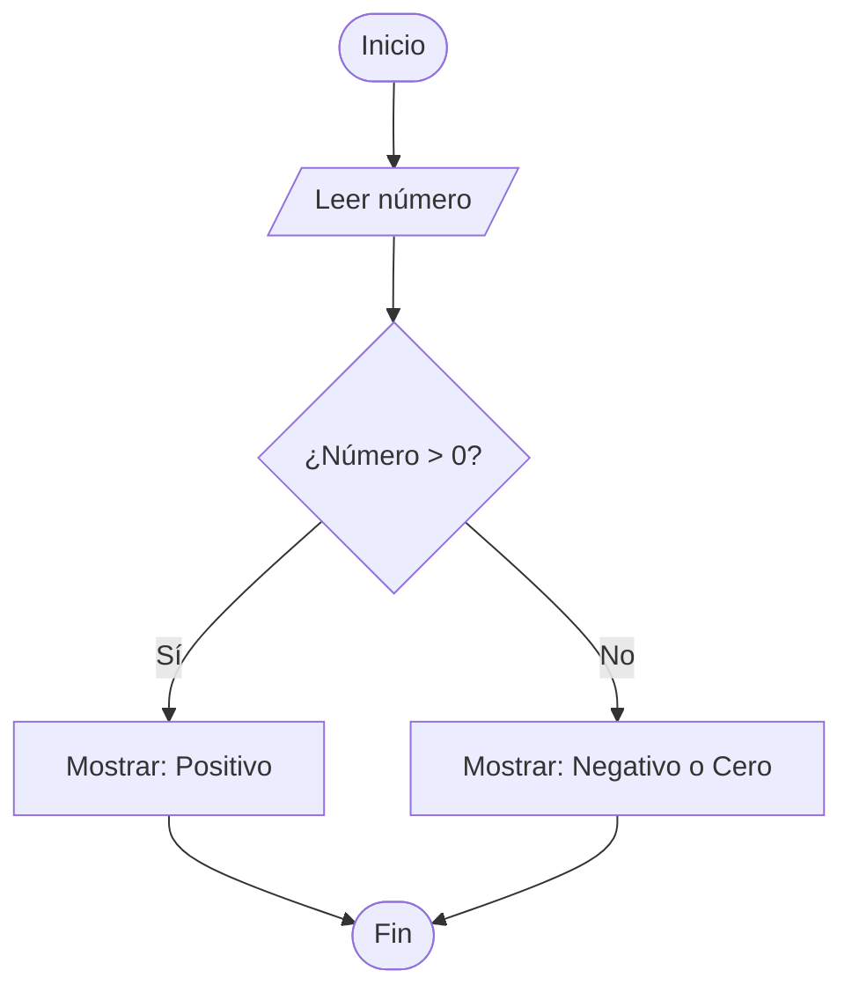

# 📝 Guía Definitiva y Apuntes Explicados de Markdown (.md)

> **¿Qué es Markdown?**  
> Es un lenguaje de marcado súper ligero. En lugar de usar botones como en Word para poner negritas o títulos, usas símbolos simples (`#`, `*`, `-`). Es el estándar para documentar proyectos en GitHub, VS Code, Notion y más.

---

## 📌 Tabla de Contenidos
- [1. Encabezados (Títulos)](#1-encabezados-títulos)
- [2. Formato de Texto](#2-formato-de-texto)
- [3. Colores y Cajas de Alerta](#3-colores-y-cajas-de-alerta)
- [4. Listas y Tareas](#4-listas-y-tareas)
- [5. Enlaces e Imágenes](#5-enlaces-e-imágenes)
- [6. Tablas](#6-tablas)
- [7. Bloques de Código](#7-bloques-de-código)
- [8. Badges e Insignias](#8-badges-e-insignias)
- [9. Secciones Desplegables (Acordeón)](#9-secciones-desplegables-acordeón)
- [10. Fórmulas Matemáticas (LaTeX)](#10-fórmulas-matemáticas-latex)
- [11. Diagramas de Flujo (Mermaid)](#11-diagramas-de-flujo-mermaid)
- [12. Teclas y Formatos Especiales](#12-teclas-y-formatos-especiales)

> **💡 ¿Cómo funciona la Tabla de Contenidos?**  
> Creas un enlace `[Nombre](#nombre-del-titulo)`. El texto entre paréntesis debe coincidir exactamente con el título al que quieres saltar, escrito en minúsculas y cambiando los espacios por guiones `-`.

---

## 1. Encabezados (Títulos)

**Explicación:** Se usan para organizar la jerarquía y estructura del documento. A mayor cantidad de `#`, menor es el tamaño del título. Siempre debes dejar un espacio entre el `#` y el texto.

# Título Principal (H1) -> Usar solo uno por documento (Título general)
## Sección (H2) -> Para los temas principales
### Subsección (H3) -> Para subtemas dentro de una sección
#### Detalle (H4) -> Para notas o puntos muy específicos

---

## 2. Formato de Texto

**Explicación:** Sirve para dar énfasis visual a palabras clave dentro de un párrafo o frase.

| Estilo | Sintaxis | Resultado | Explicación |
| :--- | :--- | :--- | :--- |
| **Negrita** | `**Texto**` o `__Texto__` | **Texto** | Encierra el texto en dos asteriscos para destacar ideas clave. |
| *Cursiva* | `*Texto*` o `_Texto_` | *Texto* | Encierra el texto en un asterisco para términos técnicos o énfasis suave. |
| ~~Tachado~~ | `~~Texto~~` | ~~Texto~~ | Encierra entre dos virgulillas para mostrar correcciones o cosas desactualizadas. |
| `Código en línea` | `` `Texto` `` | `Texto` | Encierra en comillas invertidas simples para nombrar variables, comandos o archivos. |

---

## 3. Colores y Cajas de Alerta

### Colores con HTML Integrado
**Explicación:** Markdown puro no tiene sintaxis nativa para color de texto, pero permite usar la etiqueta HTML `<font color="...">` para aplicarlo.

* <font color="red">Texto en rojo</font> → Sintaxis: `<font color="red">Texto en rojo</font>`
* <font color="#4CAF50">Texto verde (Código HEX)</font> → Sintaxis: `<font color="#4CAF50">Texto verde</font>`
* <font color="#2196F3"><b>Texto azul en negrita</b></font> → Sintaxis: `<font color="#2196F3"><b>Texto azul</b></font>`

### Cajas de Alerta Destacadas (GitHub / VS Code)
**Explicación:** Son bloques de color llamativos para resaltar información importante. Se crean usando el símbolo de cita `>` seguido del tipo de alerta entre corchetes `[!TIPO]`.

> [!NOTE]
> **Nota (Azul):** Caja azul para agregar contexto, aclaraciones o información general relevante.

> [!TIP]
> **Consejo (Verde):** Caja verde para dar trucos, recomendaciones o mejores prácticas.

> [!WARNING]
> **Advertencia (Amarillo):** Caja amarilla/naranja para aspectos a considerar con cuidado o errores comunes.

> [!CAUTION]
> **Peligro (Rojo):** Caja roja para advertencias críticas, peligro o errores graves.

---

## 4. Listas y Tareas

**Explicación:** Sirven para desglosar información de forma organizada y fácil de leer.

### Listas Desordenadas (Viñetas)
Usa un asterisco `*` o un guión `-` seguido de un espacio. Agrega 2 espacios de sangría para crear un sub-nivel.
* Elemento principal 1
* Elemento principal 2
  * Subelemento 2.1 (Indentado con 2 espacios)
  * Subelemento 2.2

### Listas Ordenadas (Numeradas)
Escribe el número seguido de un punto `1. `.
1. Primer paso
2. Segundo paso
3. Tercer paso

### Listas de Tareas (Checkboxes)
Usa `- [ ]` para tareas pendientes y `- [x]` (con una x minúscula) para tareas completadas.
- [x] Tarea completada
- [ ] Tarea pendiente por realizar

---

## 5. Enlaces e Imágenes

**Explicación:**  
* **Enlace web:** La estructura es `[Texto que hace clic](URL_del_sitio)`.  
  👉 [Ir a la documentación oficial](https://www.markdownguide.org)

* **Imagen:** Es casi igual a un enlace, pero agregas un signo de exclamación `!` al inicio: ``.  
  

---

## 6. Tablas

**Explicación:** Se construyen usando barras verticales `|` para separar columnas y guiones `-` para la fila del encabezado. Controlas la alineación con los dos puntos `:`.

| Izquierda (`:---`) | Centro (`:---:`) | Derecha (`---:`) |
| :--- | :---: | ---: |
| Úsalo para texto largo | Úsalo para códigos/iconos | Úsalo para números y precios |
| Concepto A | 100 | $15.000 |
| Concepto B | 200 | $25.000 |

---

## 7. Bloques de Código

**Explicación:** Encierra tu código entre **tres comillas invertidas (```)** al inicio y al final. Si escribes el nombre del lenguaje justo al lado de las primeras comillas, el editor aplicará colores según la sintaxis.

```javascript
// Ejemplo en JavaScript
const saludar = (nombre) => {
    console.log(`¡Hola, ${nombre}!`);
};
```

```python
# Ejemplo en Python
def calcular_area(radio):
    return 3.1416 * (radio ** 2)
```

```pseint
// Ejemplo en PSeInt
Algoritmo Saludo
    Escribir "¡Hola Mundo desde PSeInt!";
FinAlgoritmo
```

---

## 8. Badges e Insignias

**Explicación:** Son imágenes dinámicas creadas por el sitio [Shields.io](https://shields.io/). Se usan al inicio de proyectos o perfiles para mostrar tecnologías o estados de manera visual.


**Estructura de la URL:**
``

---

## 9. Secciones Desplegables (Acordeón)

**Explicación:** Utiliza las etiquetas HTML `<details>` y `<summary>` para ocultar contenido extenso, soluciones de ejercicios o código largo para no saturar la lectura inicial.

<details>
<summary>▶ <b>Haz clic aquí para ver la respuesta o el contenido oculto</b></summary>

<br>

¡Hola! 👋 Aquí adentro puedes colocar explicaciones largas, respuestas o bloques de código adicionales sin ocupar espacio en la vista principal.

</details>

---

## 10. Fórmulas Matemáticas (LaTeX)

**Explicación:** Permite renderizar fórmulas y símbolos matemáticos complejos mediante el lenguaje LaTeX.

* **Fórmula en la misma línea (Inline):** Enciérrala entre un signo de dólar `$ ... $`.  
  Ejemplo: La famosa fórmula $E = mc^2$ o la ecuación $x^2 + y^2 = z^2$.

* **Fórmula centrada en un bloque separado:** Enciérrala entre dos signos de dólar dobles `$$ ... $$`.

$$f(x) = \frac{-b \pm \sqrt{b^2 - 4ac}}{2a}$$

> *Sintaxis clave:* `\frac{numerador}{denominador}` crea fracciones y `\sqrt{x}` representa la raíz cuadrada.

---

## 11. Diagramas de Flujo (Mermaid)

**Explicación:** Permite dibujar diagramas de flujo directamente escribiendo código dentro de un bloque ```mermaid```, sin necesidad de programas de diseño.

### 🧩 Guía de Simbología
1. `graph TD;` → Define que la orientación del diagrama va de arriba a abajo (*Top-Down*).
2. `([Texto])` → Forma de óvalo (se usa para **Inicio** y **Fin**).
3. `[/Texto/]` → Forma de paralelogramo (se usa para **Entrada/Lectura** de datos).
4. `{Texto}` → Rombo (se usa para **Condiciones / Decisiones**).
5. `[Texto]` → Forma de rectángulo (se usa para **Acciones o Procesos**).
6. `-- Texto -->` → Flecha con una etiqueta sobre la línea.

### 📐 Ejemplo Completo



---

## 12. Teclas y Formatos Especiales

**Explicación:** Trucos de formato adicionales utilizando etiquetas HTML integradas.

* **Teclas visuales:** La etiqueta `<kbd>Tecla</kbd>` simula un botón del teclado.  
  Ejemplo: Presiona <kbd>Ctrl</kbd> + <kbd>Shift</kbd> + <kbd>V</kbd> en VS Code para abrir la vista previa.
* **Subrayado:** La etiqueta `<ins>texto</ins>` subraya una palabra -> <ins>Texto subrayado</ins>.
* **Resaltado:** La etiqueta `<mark>texto</mark>` aplica un destacado amarillo -> <mark>Texto resaltado</mark>.
* **Subíndices:** La etiqueta `<sub>` baja el texto -> H<sub>2</sub>O.
* **Superíndices:** La etiqueta `<sup>` sube el texto -> 2<sup>10</sup> = 1024.